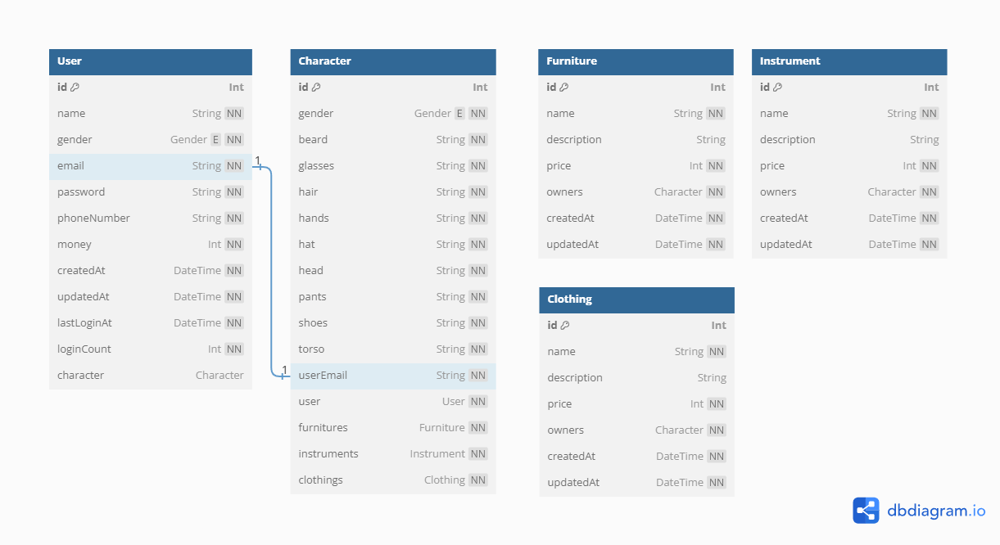

# Prerequisite

1. Already installed [docker](https://www.docker.com/) and [docker compose](https://docs.docker.com/compose/)
2. Make sure the [ports](#ports) are not used by other services

# Installation

1. Download the project

```bash
git clone https://github.com/LeeChasel/mvr-backend.git
```

2. Copy `.env.example` to `.env`, and fill in environment variables

3. First need to [execute](#execution) the service, then use the [command](#seed-initial-data-to-the-database) the seed initial data

# Execution

In the project directory

```bash
docker compose up
```

## Services

### Ports

| **Service**   | **Port** |
| ------------- | -------- |
| Nestjs        | 64550    |
| PostgreSQL    | 5432     |
| Prisma Studio | 5555     |
| Adminer       | 8080     |

### Adminer

| **Field** | **Value**  |
| --------- | ---------- |
| DBSystem  | PostgreSQL |
| Server    | postgres   |
| Account   | root       |
| Password  | root       |
| DB        | _empty_    |

### Swagger for api document

Go to `<baseURL>:64550/api`

### Seed initial data to the database

```bash
 docker compose exec nestjs npx prisma db seed
```

## Entity-Relationship Diagram


